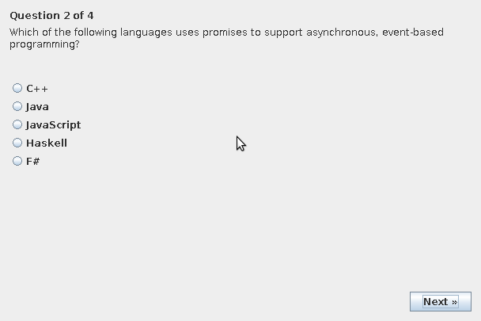

# Exam Application for YSC3232 Lab 2

The goal of this lab was to write set of classes to represent an examination, and
to create an application that uses them to store, load, and present an examination
to the current user. Here, I will describe the rationale behind my class structure,
and the graphical application I have created using Swing that allows a user to
take an exam and receive some automatic feedback on their performance.

## Building and Running

You can open the root directory of this GitHub repository as a project in NetBeans,
and click 'Run Project' to build and run the test application.

## Exam Structure

The `Exam` class stores an examination, which contains

* A title
* Welcome text to be displayed to the user before the exam begins
* "Finished text" to be displayed to the user after the exam ends
* A list of exam questions.

Multiple question types are supported, with all exam questions implementing the
`ExamQuestion` interface. All question types implementing this interface must
be able to:

* Return their question text (`text()`)
* Get and set the current answer (`answer()`, `setAnswer()`)
* Get the correct answer (if any) (`correctAnswer()`)
* Score the current question (`score()`)

Question types can, but are not required to support automatic scoring. When a
question that cannot be scored automatically is queried for its score, the
question may indicate it does not support automatic scoring with its return value.

Currently, three question types are supported:

* Multiple choice, which supports automatic scoring
* Short answer, which supports automatic scoring. This question type is designed
for short, but still free form answers, where the correct answer is one word or a
very short phrase.
* Extended answer, which does not support automatic scoring.

Exams can be marshalled and unmarshalled to and from XML via JAXB. Marshalling and
unmarshalling only preserves the exam metadata and question data (not answers), 
because the main intent of unmarshalling is to display an exam stored in a file
to the user. Answers should be captured or stored seperately, and are currently
scored and printed to the console at the end of the exam.

## Application

I include a small application using Swing that allows a user to take a given exam,
and view a score report printed to the terminal afterwards. All question types are
required to implement a `createJPanel()` method that generates a JPanel component
to display the given question and allow the user to enter their answer. These panels,
along with panels to display the welcome and finished texts of the exam, are displayed
one-at-a-time to the user with a `CardLayout` as they complete the exam.

Currently, the `ExamMain` class includes a small test program that:

1. Generates a sample exam with all supported question types
2. Saves this exam to a temporary XML file using JAXB
3. Loads the saved exam, and ensures it is the same as the exam saved.
4. Allows users to take the exam and view their score report.

Here is a screenshot of the application interface:

